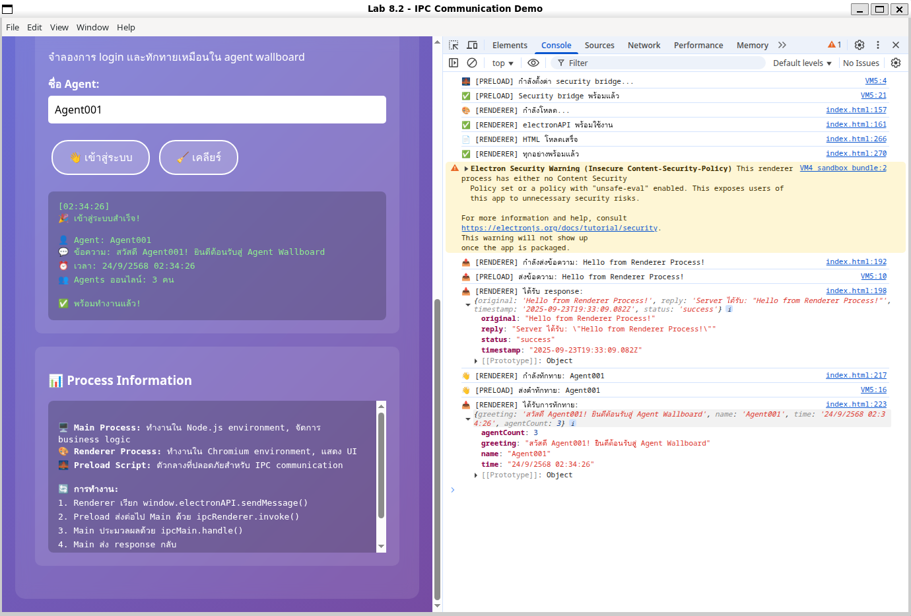
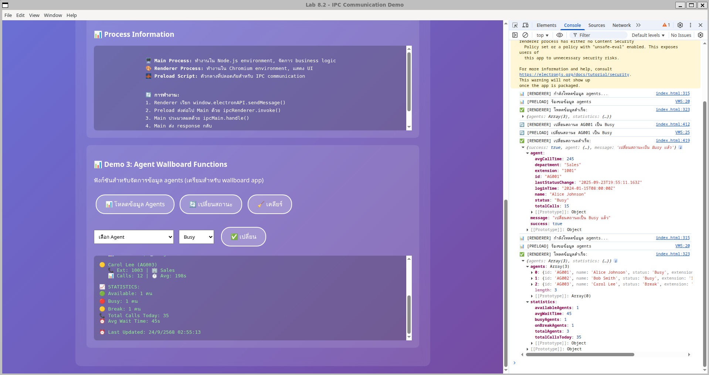
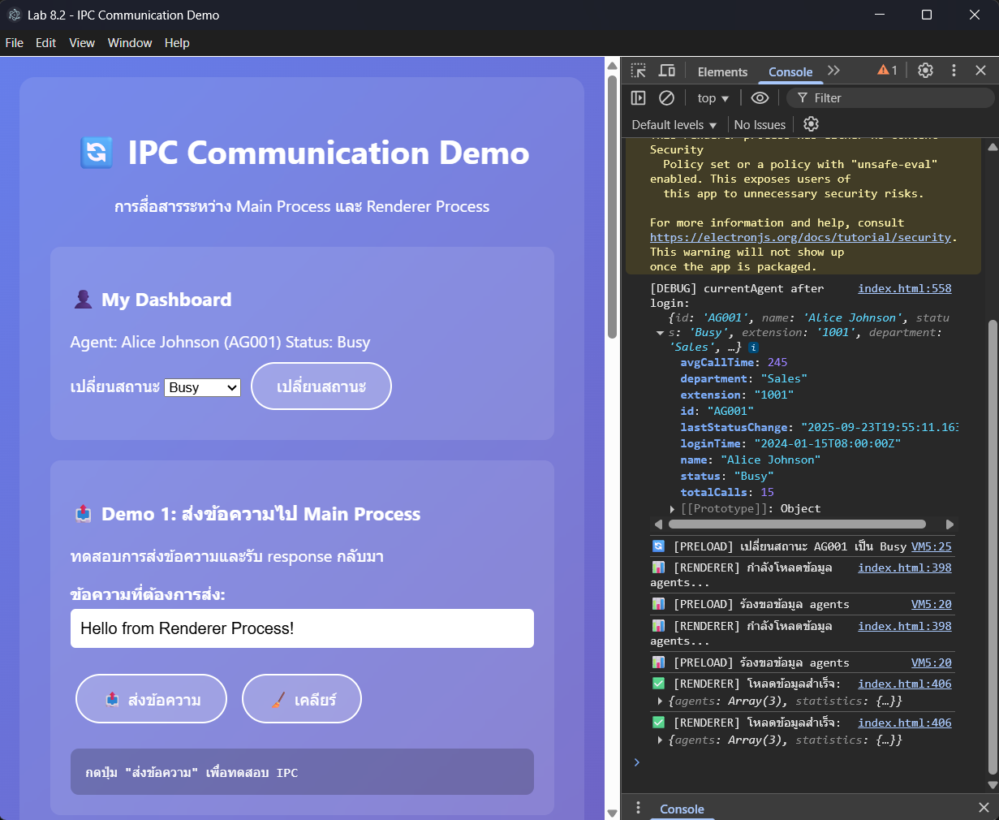

# lab8-2-ipc

- test desktop app

- Assignment 

## งานที่ทำเพิ่ม

1. สร้างระบบ Login:
- เพิ่ม form login (agent ID + password)
- สร้าง IPC handler สำหรับ authentication
- จำลองการตรวจสอบ credentials

2. Dashboard หลัง Login:
- แสดงข้อมูลเฉพาะ agent ที่ login
- ปุ่มเปลี่ยนสถานะตัวเอง
- แสดงสถิติส่วนตัว

3. Notification System:
- แสดง popup เมื่อมี agent เปลี่ยนสถานะ
- ใช้ JavaScript alert()