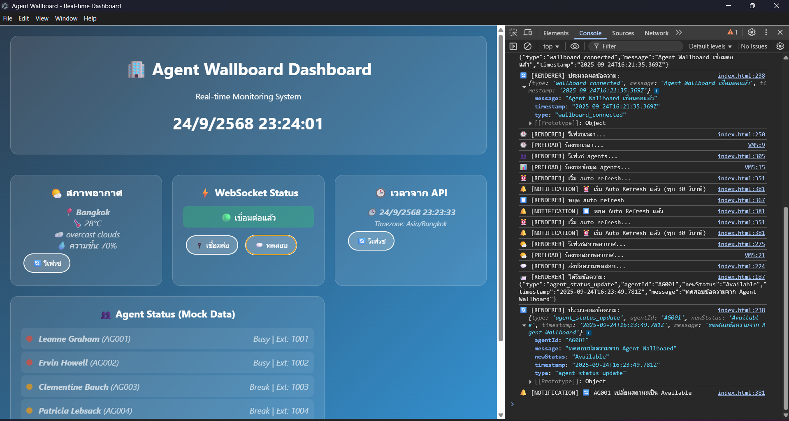
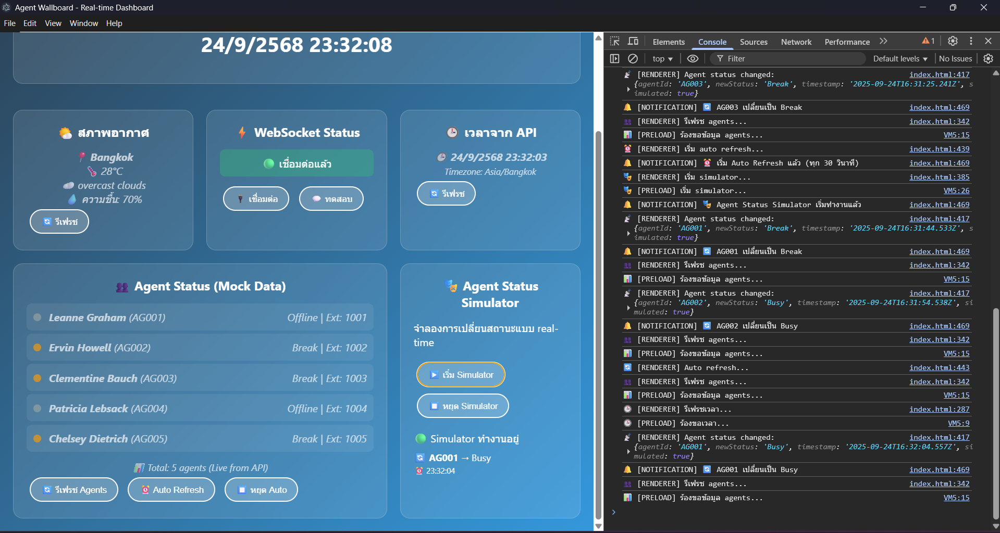
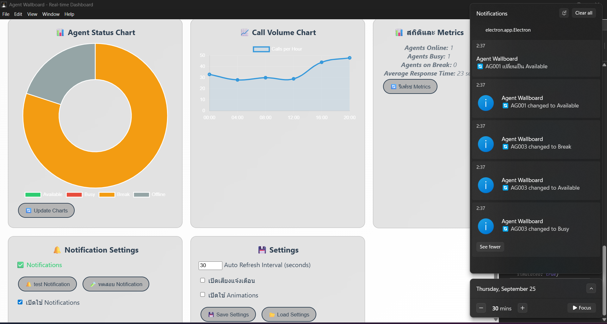

# lab8-4-api-real-time-communication

## test desktop app

## เพิ่มสถิติและ metrics

## Bonus Features:
1. 🔔 Desktop Notifications เมื่อ agent เปลี่ยนสถานะ
2. 📈 Charts แสดงสถิติแบบ real-time
3. 🌙 Dark/Light Mode toggle
4. 💾 Save/Load settings
