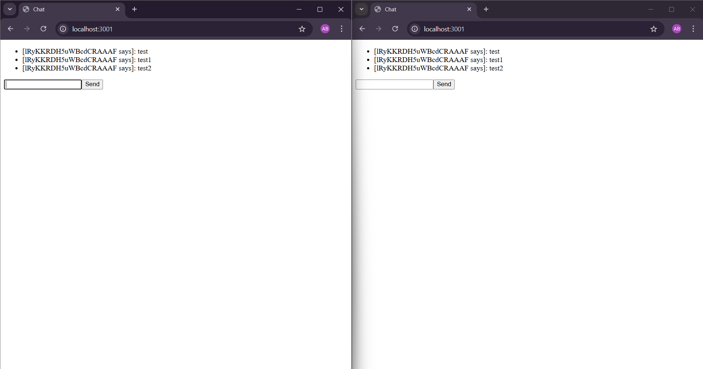

## เป็น wed สำหรับแสดงข้อมูลแบบ real-time โดยใช้ WebSocket ทำให้หน้าเว็บแสดงแบบ real-time

## library ที่ใช้
- npm install express 
- Web Framework ที่จะช่วยให้เราสร้าง Server และ API ได้ง่ายและรวดเร็วขึ้นมาก
- npm install --save-dev nodemon 
- คือเครื่องมือที่จะคอยสอดส่องไฟล์ในโปรเจกต์ของเรา และเมื่อมีการเปลี่ยนแปลง (เช่น กดเซฟ) มันจะทำการรีสตาร์ทเซิร์ฟเวอร์ให้เราโดยอัตโนมัติ
- --save-dev หมายถึง ติดตั้งเป็น dependency สำหรับตอนพัฒนาเท่านั้น
- npm install dotenv
- คือเครื่องมือที่ช่วยโหลด "Environment Variables" (ค่าตัวแปรของระบบ) จากไฟล์ .env เข้าสู่ process.env ใน Node.js
- npm install cors
- เป็น Middleware ที่ช่วยจัดการเรื่อง Cross-Origin Resource Sharing
- npm install helmet 
- เป็น Middleware ที่ช่วยตั้งค่า HTTP Headers ต่างๆ
- npm install joi
- ป็น Library สำหรับตรวจสอบและยืนยันความถูกต้องของข้อมูล (Data Validation) ที่ทรงพลังและใช้ง่าย
## สามารถ ใช้ npm i ในการติดตั้งไหล์ทั้งหมดที่อยู่ใน package.json ได้เลย
## ผลลัพท์
- 