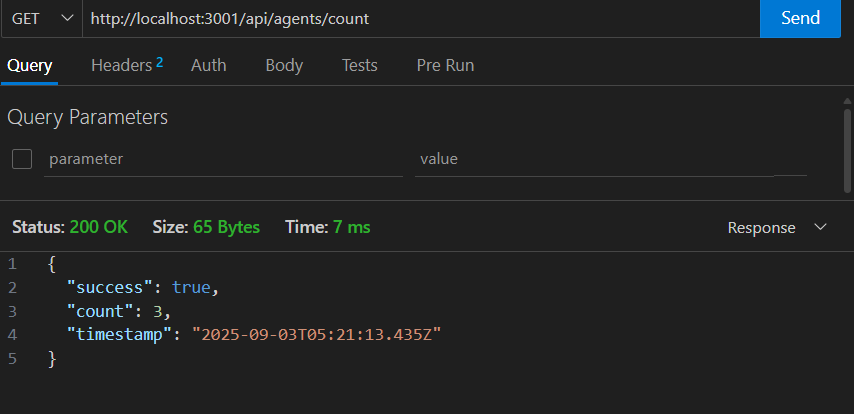

# in-class-workshop

## ผลลัพธ์

- http://localhost:3001/api/agents
ดึงข้อมูลจาก data agents มาแสดงแบบ json โดย success เป็น true สถานะอิงจาก data 
 

- http://localhost:3001/api/agents/count
สร้าง api ใหม่ ให้แสดงข้อมูลเฉพาะ success และ count และ timestamp
 

- http://localhost:3001/api/agents/A001/status
อัปเดตค่า เฉพาะ status ที่ A001 ให้เป็น Available แล้วส่ง Response กลับมา
 

- http://localhost:3001/api/agents/A001/status
อัปเดตค่า เฉพาะ status ที่ A001 ให้เป็น Sleeping แล้วส่ง Response กลับมา ได้ค่าเป็น false เพราะ validStatuses ไม่มี Sleeping
 

- http://localhost:3001/api/agents/A999/status
อัปเดตค่า เฉพาะ status ที่ A999 แล้วส่ง Response กลับมา ได้ Not_Found เพราะ ไม่มี ข้อมูล ของ A999
 

- http://localhost:3001/api/dashboard/stats
แสดง ข้อมูลทั้งหมด พร้อมนับจำนวน สถานะแต่ละสถานะ และ คำนวนออกมาเป็น %
 

- ทดสอบการดึง api ฝั่ง client ให้แสดง เป็น object ผ่าน console
 

- http://localhost:3001/api/agents/A001/login
ส่งข้อมูล การ login ไปให้ฝั่ง server และ Response กลับมาพร้อมข้อมูลที่มีการอัปเดตใหม่ 
 

- http://localhost:3001/api/agents/A001/logout
ส่งข้อมูล การ logout ไปให้ฝั่ง server และ Response กลับมาพร้อมข้อมูลที่มีการอัปเดตใหม่ 
 